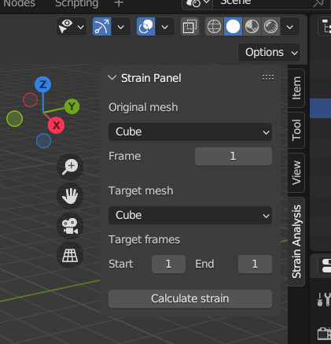
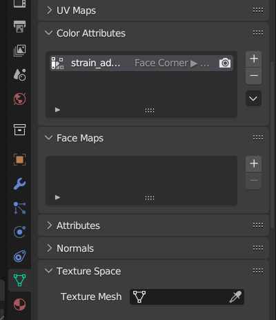

# Blender-Mesh-Strain-Analyzer Addon
(→[日本語](./README_JP.md))

This addon calculates mesh strains based on the original and deformed mesh shapes and sets vertex colors accordingly. The strain information can be used for various purposes, such as identifying areas where deformation occurs too much or creating procedural textures based on mesh shapes.

## Usage
1. Save the project directory as a ZIP.
2. Click <code>Edit</code> > <code>Preference</code> on the Blender menu bar. Select the <code>Add-ons</code> tab in the window, press the <code>install</code> button, and open the ZIP without unzipping it.
3. Check the "Mesh: Mesh Strain Analysis" checkbox in the addon list to activate this addon.
4. If the side bar is not displayed in the 3D viewport, hover the mouse over the 3D viewport and press the <code>N</code> key.
5. Select <code>Strain analysis</code> tab to open the <code>Strain Panel</code>.
6. In the <code>Original mesh</code> pull-down menu, specify the mesh objects and frames that have the shape of the original mesh.
7. Specify the target mesh and frame for which the strain is to be calculated.
8. Press the <code>Calculate strain</code> button to run the calculation.
9. This will add a color attribute named <code>strain_addon_color_layer</code> to the target mesh, which contains strain data.

    
    

## Demo
|       |       |
| :---: | :---: |
|  |  |

## Note
- The strain calculation may take some time for large meshes.
- The strain calculation is based on the assumption that the original and deformed meshes have the same topology.
- If the target mesh has a physics simulation set up, the calculation will be performed using the simulation cache if it exists, and the cache will be baked and used for the calculation if it does not exist.
    - To update an existing cache, go to the <code>Physics properties</code> tab in the <code>Properties</code> window and open the <code>Cache</code> section. Then, click on the <code>Delete Bake</code> button to delete the current cache and bake a new one for updated calculations.
    

## Additional Information
### How it Works
- The addon calculates strains of mesh by comparing the original mesh with the deformed mesh on a per-vertex basis. For each vertex, the addon calculates the weighted average of max principal strains of the meshes around a vertex. 
- The vertex color is then set based on the magnitude of this strain. The vertex color is green when there is no distortion, turn progressively red as it increases beyond zero, and turn progressively blue as it decreases below zero.

## License
This addon is licensed under the [MIT License](./LICENSE).