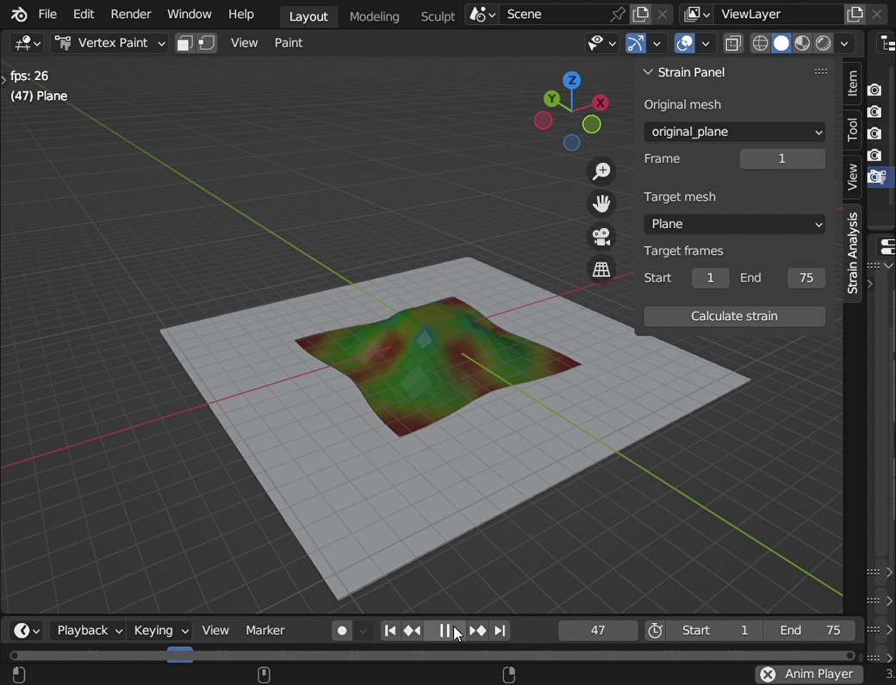
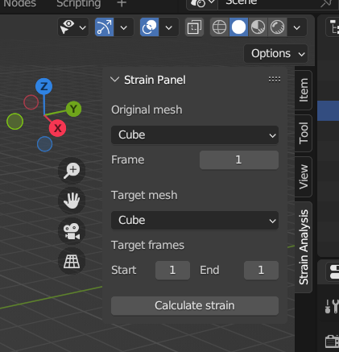
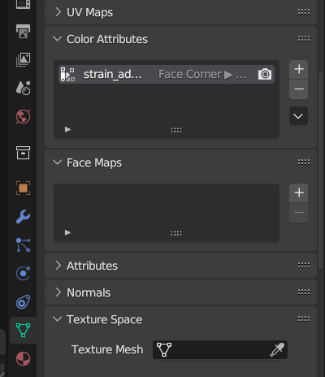
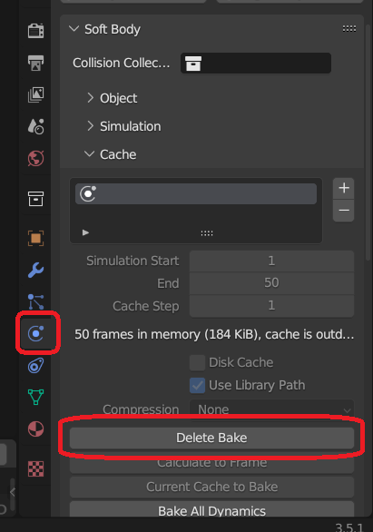

# Blender-Mesh-Strain-Analyzer Addon
このアドオンは，Blender上で元のメッシュと変形後のメッシュの頂点位置から歪みを計算し，これに応じて頂点カラーを設定するアドオンです．歪みの情報は，変形が大きくなる部分を特定したり，メッシュの形状を元にプロシージャルテクスチャを作成するなど，様々な用途に利用できます．

## Usage

1. プロジェクトファイルをZIPファイルとして保存します.
2. メニューバーの<code>Edit</code> > <code>Preference</code>をクリックします．表示されたウィンドウの<code>Add-ons</code>タブを選択し， <code>install</code> ボタンを押してZIPファイルを解凍せずに開いてください.
3. アドオン一覧の<code>Mesh: Mesh Strain Analysis</code>のチェックボックスにチェックしてアドオンを有効化します.
4. サイドバーが3Dビューポートに表示されていない場合，3Dビューポートの上にマウスを置いて<code>N</code>キーを押してください.
5. サイドバーの<code>Strain analysis</code>タブをクリックし，<code>Strain Panel</code>を表示します.
6. <code>Original mesh</code>のプルダウンメニューから元の形状を持つメッシュオブジェクトを選択し，フレームを指定します.
7. ターゲットとなる変形後のメッシュを選択し，計算を行うフレーム範囲を指定します.
8. <code>Calculate strain</code>ボタンをクリックし，計算を行います.
9. これにより，ターゲットメッシュに歪みのデータを保持する<code>strain_addon_color_layer</code>という名前のカラーアトリビュートが追加されます.

## Demo
|       |       |
| :---: | :---: |
|  |  |

## Note
- 頂点数の多いメッシュの歪みを計算する場合，計算に時間がかかります.
- 歪みの計算は，元のメッシュと変形後のメッシュが同一のトポロジー（メッシュ構造）を持つと仮定して行われます.
- ターゲットメッシュに物理シミュレーションが設定されている場合，シミュレーションキャッシュが存在するときにはそれを利用して計算を行い，存在しない場合にはシミュレーションキャッシュをベイクして計算を行います．
    - 既存のキャッシュを更新する場合，<code>Properties</code>ウィンドウの<code>Physics properties</code>タブを選択し，<code>Cache</code>を開きます．そして，<code>Delete Bake</code>ボタンをクリックして既存のキャッシュを削除します．
    

## Additional Information
### How it Works
- このアドオンは，元のメッシュと変形後のメッシュを比較することで，頂点ごとの歪みを計算します．それぞれの頂点について，頂点周りのメッシュの2次元歪みからメッシュの最大主ひずみを計算し，重み付き平均をとることで頂点の歪みとしています．
- 頂点カラーは歪みの大きさにより設定されます．歪みがない場合は緑色を設定し，歪みが正になるにつれて赤に近づき，負になるにつれて青に近づきます．

## License
このアドオンは[MIT License](./LICENSE)のもとでライセンスされています.